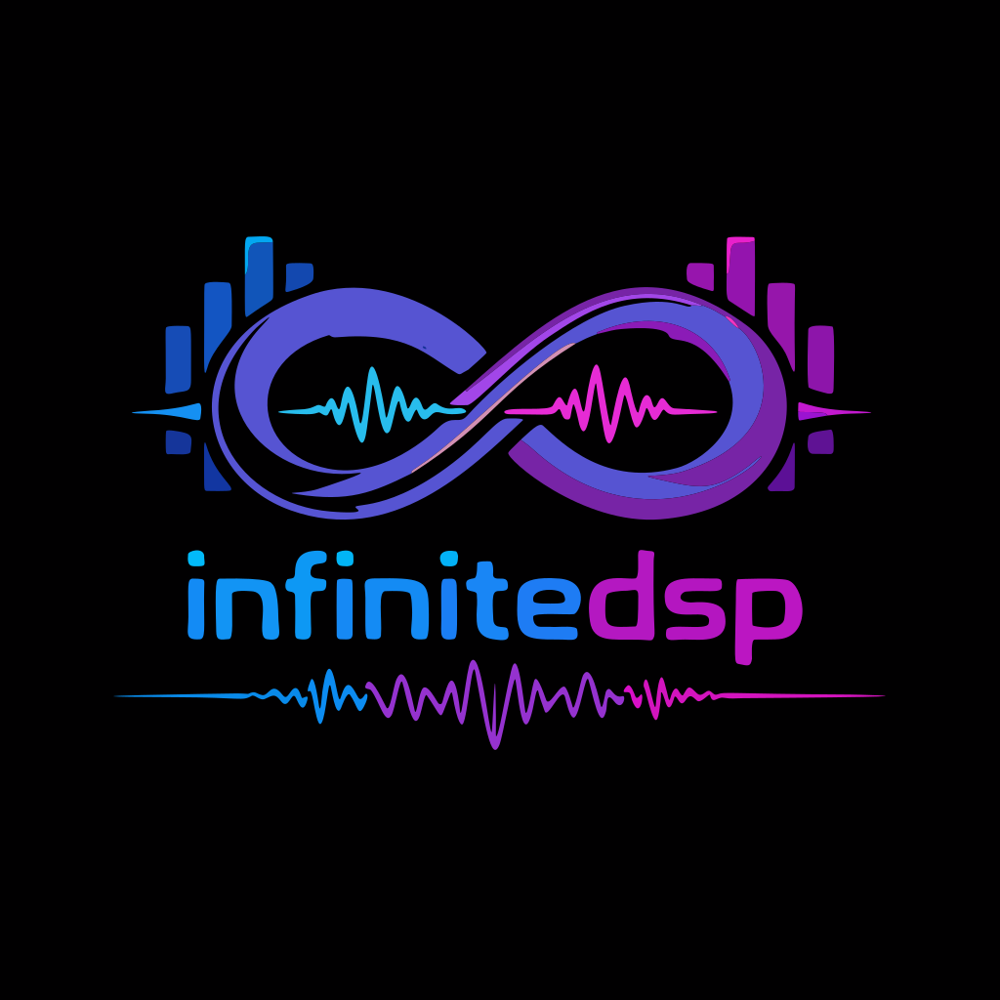

<div align="center">
  
</div>

# InfiniteDSP Core

A modular, high-performance audio DSP library for Rust, designed for real-time synthesis and effects processing. 
It is `no_std` compatible (requires `alloc`), making it suitable for embedded audio applications as well as desktop software.

## Features

*   **`no_std` Compatible:** Built for portability using `libm` and `alloc`.
*   **Modular Architecture:** Build complex audio chains using `DspChain` and `Mixer`.
*   **AudioParam System:** All parameters can be static, linked to thread-safe controls (atomics), or modulated by other audio signals (e.g., LFOs, Envelopes) at sample rate.
*   **SIMD Optimization:** Uses `wide` for SIMD-accelerated processing where applicable.
*   **Spectral Processing:** Includes a robust Overlap-Add (OLA) engine for FFT-based effects.
*   **Comprehensive Effect Suite:**
    *   **Time:** Delay, Tape Delay (with saturation & flutter), Reverb (Schroeder).
    *   **Filter:** Biquad (LowPass, HighPass, BandPass, Notch), Ladder Filter (Moog-style).
    *   **Dynamics:** Compressor, Limiter, Distortion (Soft/Hard Clip, BitCrush, Foldback).
    *   **Modulation:** Phaser, Tremolo, Ring Modulator, Chorus, Flanger.
    *   **Spectral:** FFT Pitch Shift, Granular Pitch Shift, Spectral Filter.
*   **Synthesis:**
    *   **Oscillators:** Sine, Triangle, Saw, Square (PolyBLEP anti-aliased), Noise.
    *   **Physical Modeling:** Karplus-Strong (String), Brass Model.
    *   **Control:** LFO, ADSR Envelope.


## Demos

Listen to some renderings of the examples below:

*   **[Trance Synth Demo](assets/audio/trance_synth.wav)** - The trance synth example.
*   **[FM Brass Demo](assets/audio/filter_sweep.wav)** - The filter sweep example.


## Project Structure

*   `src/core`: Core traits and infrastructure (`FrameProcessor`, `AudioParam`, `DspChain`, `Ola`).
*   `src/effects`: Audio effects implementations.
*   `src/synthesis`: Sound generators and control signals.
*   `examples_app`: A separate workspace member containing runnable examples using `cpal`.

## Usage

Add `infinitedsp-core` to your dependencies.

```rust
use infinitedsp_core::core::dsp_chain::DspChain;
use infinitedsp_core::core::audio_param::AudioParam;
use infinitedsp_core::synthesis::oscillator::{Oscillator, Waveform};
use infinitedsp_core::effects::time::delay::Delay;

// Create an oscillator
let osc = Oscillator::new(AudioParam::hz(440.0), Waveform::Saw);

// Create a delay effect
let delay = Delay::new(
    1.0, // Max delay time in seconds
    AudioParam::ms(350.0),   // Delay time
    AudioParam::linear(0.5), // Feedback
    AudioParam::linear(0.3)  // Mix
);

// Chain them together
let mut chain = DspChain::new(osc, 44100.0).and(delay);

// Process a buffer
let mut buffer = [0.0; 512];
chain.process(&mut buffer, 0);
```

## Running Examples

The project includes several runnable examples in the `examples_app` folder that demonstrate different capabilities using `cpal` for real-time audio output.

Run an example using:
```sh
cargo run --release -p infinitedsp-examples --bin <example_name>
```

### Available Examples:

*   **`filter_sweep`**: A subtractive synth patch with an LFO modulating a Ladder Filter cutoff.
*   **`fm_brass`**: FM synthesis demonstration with envelopes controlling modulation index.
*   **`trance_synth`**: A massive stereo supersaw trance pluck with delay, reverb, and a sequencer.
*   **`karplus_demo`**: Physical modeling of a guitar string (Karplus-Strong algorithm).
*   **`spectral_demo`**: FFT-based Pitch Shifting using the Overlap-Add (OLA) engine.
*   **`granular_demo`**: Time-domain Granular Pitch Shifting.

## Documentation

To generate and view the API documentation:

```sh
cargo doc --open
```

## License

This project is licensed under the MIT License - see the [LICENSE](LICENSE) file for details.
