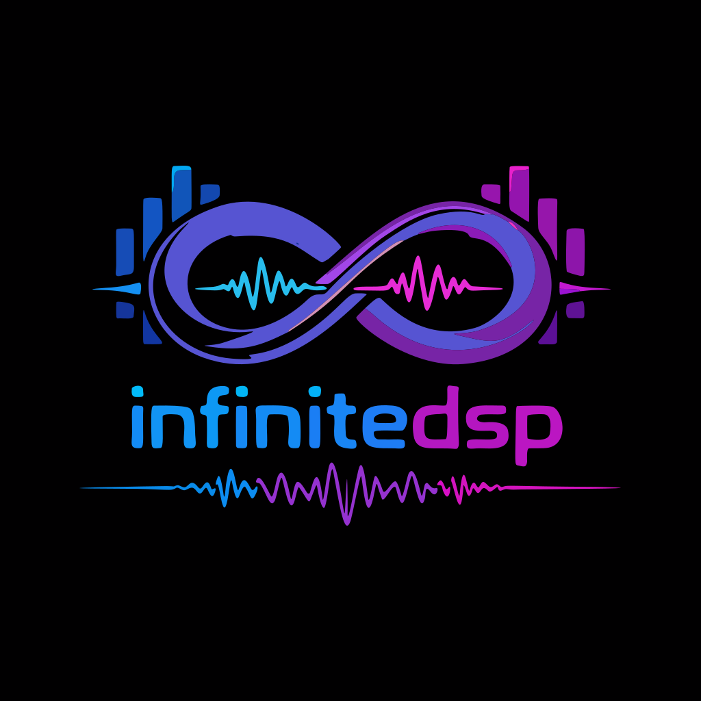

<div align="center">
  
</div>

# InfiniteDSP Core

[](https://github.com/Na1w/infinitedsp/actions/workflows/rust.yml)
[](https://github.com/Na1w/infinitedsp/actions/workflows/benchmark.yml)
[](LICENSE)
[](https://crates.io/crates/infinitedsp-core)
[](https://docs.rs/infinitedsp-core)

A modular, high-performance audio DSP library for Rust, designed for real-time synthesis and effects processing. 
It is `no_std` compatible (requires `alloc`), making it suitable for embedded audio applications as well as desktop software.

## Features

*   **`no_std` Compatible:** Built for portability using `libm` and `alloc`.
*   **Type-Safe Channel System:** Explicit `Mono` and `Stereo` types prevent routing errors.
*   **Modular Architecture:** Build complex audio chains using `DspChain` and `Mixer`.
*   **Static Dispatch:** Use `StaticDspChain` for zero-overhead composition of processors, allowing for aggressive compiler inlining.
*   **AudioParam System:** All parameters can be static, linked to thread-safe controls (atomics), or modulated by other audio signals (e.g., LFOs, Envelopes) at sample rate.
*   **Signal Math:** Combine signals easily with `Add` and `Multiply` processors.
*   **SIMD Optimization:** Uses `wide` for SIMD-accelerated processing where applicable.
*   **Graph Visualization:** Generate ASCII diagrams of your signal chain for easy debugging (`chain.get_graph()`).
*   **Spectral Processing:** Includes a robust Overlap-Add (OLA) engine for FFT-based effects.
*   **Comprehensive Effect Suite:**
    *   **Time:** Delay (Standard & LowMem), Tape Delay (with saturation & flutter), PingPongDelay, Reverb (Schroeder, Standard & LowMem), Stutter.
    *   **Filter:** Biquad (LowPass, HighPass, BandPass, Notch), Ladder Filter (Moog-style, both Iterative and Predictive ZDF), State Variable Filter (TPT/ZDF), Vowel Filter.
    *   **Dynamics:** Compressor, Limiter, Distortion (Soft/Hard Clip, BitCrush, Foldback).
    *   **Modulation:** Phaser, Tremolo, Ring Modulator, Chorus, Flanger.
    *   **Spectral:** FFT Pitch Shift, Granular Pitch Shift, Spectral Filter.
    *   **Utility:** Gain, Offset, Stereo Panner, Stereo Widener, MapRange, TimedGate.
*   **Synthesis:**
    *   **Oscillators:** Sine, Triangle, Saw, Square (PolyBLEP anti-aliased), Noise, Stack (Detuned Multi-Osc).
    *   **Vocal:** Speech Synthesizer (Formant-based).
    *   **Physical Modeling:** Karplus-Strong (String), Brass Model.
    *   **Control:** LFO, ADSR Envelope (with retrigger support).

## Benchmarks

Performance (instruction counts, via `iai-callgrind`) is tracked over time to ensure no regressions.
[View Benchmark Charts](https://na1w.github.io/infinitedsp/dev/bench/)

The suite is run in two configurations on every push, so each benchmark appears as two tracked series:

*   the default **bit-exact** build, and
*   the same build with **`perf-approximations`** (suffixed ` (perf-approximations)` in the charts).

Comparing the two shows the per-effect instruction savings of the approximations — most visible on `bench_oscillator::sine`, `bench_svf_lowpass`, `bench_compressor` and `bench_speech_synth`.

To reproduce locally:

```sh
cargo bench                                # bit-exact
cargo bench --features perf-approximations # approximations
```

## Documentation
[View Documentation](https://na1w.github.io/infinitedsp/docs/)

## Demos

Listen to some of the examples generated with this library:

[](assets/audio/filter_sweep.wav)

[](assets/audio/trance_synth.wav)

[](assets/audio/speech_output.wav)

## Showcase

Check out these projects built with `infinitedsp-core`:

*   **[InfiniteTrak](https://github.com/Na1w/infinitetrak)**
*   **[picoDSP](https://github.com/Na1w/picoDSP)**
*   **[picoDSP-Edit](https://github.com/Na1w/picoDSP-Edit)**

## Project Structure

*   `src/core`: Core traits and infrastructure (`FrameProcessor`, `AudioParam`, `DspChain`, `Ola`, `ParallelMixer`, `SummingMixer`, `Stereo`).
*   `src/effects`: Audio effects implementations.
*   `src/synthesis`: Sound generators and control signals.
*   `examples_app`: A separate workspace member containing runnable examples using `cpal`.

## Usage

Add `infinitedsp-core` to your dependencies.

```rust
use infinitedsp_core::core::dsp_chain::DspChain;
use infinitedsp_core::core::audio_param::AudioParam;
use infinitedsp_core::core::channels::Mono;
use infinitedsp_core::synthesis::oscillator::{Oscillator, Waveform};
use infinitedsp_core::effects::time::delay::Delay;

// Create an oscillator (Mono source)
let osc = Oscillator::new(AudioParam::hz(440.0), Waveform::Saw);

// Create a delay effect (Mono effect)
let delay = Delay::new(
    1.0, // Max delay time in seconds
    AudioParam::ms(350.0),   // Delay time
    AudioParam::linear(0.5), // Feedback
    AudioParam::linear(0.3)  // Mix
);

// Chain them together. The chain is typed as DspChain<Mono>.
let mut chain = DspChain::new(osc, 44100.0).and(delay);

// Print the signal chain (requires 'debug_visualize' feature)
println!("{}", chain.get_graph());

// Process a buffer
let mut buffer = [0.0; 512];
chain.process(&mut buffer, 0);
```

### Feature Flags

*   **`debug_visualize`**: Enables `get_graph()` and `visualize()` methods for debugging signal chains. Disabled by default to minimize binary size for embedded targets.
*   **`perf-approximations`**: Swaps the exact `libm` transcendentals (`tan`/`sin`/`log`/`exp`) in the per-sample DSP hot paths for cheap polynomial / float-bit-trick approximations. **Off by default** — the default build is bit-exact. These give large speedups on targets *without* a hardware transcendental unit (e.g. the Cortex-M7, where a single `libm` call is ~1250 cycles), at the cost of small, bounded error:
    *   `Oscillator` (`Sine`) — parabolic + one refinement pass, ~0.2% peak error vs `libm::sinf`.
    *   `StateVariableFilter` prewarp — Padé[3/2] `tan(x) ≈ x(15 - x²)/(15 - 6x²)`, <0.2% error for cutoffs up to ~9.8 kHz @ 48 kHz.
    *   `Compressor` gain computer — fast `log2`/`exp2` (one `log` + one `exp` per sample), fit to <0.0002 dB and <0.001% over the gain computer's range.

    The errors are inaudible in smooth, envelope-driven processing, but the feature is opt-in so the default build stays bit-exact. The [benchmark suite](#benchmarks) runs both with and without the flag so the per-effect speedup is tracked over time.

## Running Examples

The project includes several runnable examples in the `examples_app` folder that demonstrate different capabilities using `cpal` for real-time audio output.

Run an example using:
```sh
cargo run --release -p infinitedsp-examples --bin <example_name>
```

### Available Examples:

*   **`infinitedsp_demo`**: A complex polyphonic demo showcasing 30 voices, filters, envelopes, and effects (Stereo).
*   **`speech_synth`**: Formant-based vocal synthesizer demo with rhythmic glitch effects.
*   **`filter_sweep`**: Compares `PredictiveLadderFilter` vs `LadderFilter` with an LFO sweep (Mono).
*   **`dual_mono_demo`**: Demonstrates independent processing of Left/Right channels (Ping-Pong Delay).
*   **`ping_pong_demo`**: Demonstrates the stereo PingPongDelay effect.
*   **`trance_synth`**: A massive stereo supersaw trance pluck with delay, reverb, and a sequencer.
*   **`karplus_demo`**: Physical modeling of a guitar string (Karplus-Strong algorithm) (Mono).
*   **`svf_demo`**: State Variable Filter demonstration (BandPass sweep).
*   **`spectral_demo`**: FFT-based Pitch Shifting using the Overlap-Add (OLA) engine.
*   **`granular_demo`**: Time-domain Granular Pitch Shifting.
*   **`modulation_demo`**: Showcases Tremolo, Chorus, and Tape Delay.
*   **`phaser_demo`**: 6-stage Phaser effect.
*   **`effects_demo`**: Demonstrates signal math (Add/Multiply) and distortion.

## Documentation

To generate and view the API documentation:

```sh
cargo doc --open
```

## AI Contribution Policy

This project allows and encourages experimentation with AI agents for code generation and optimization. However, all AI-generated contributions must be strictly verified by a human maintainer. This verification includes:
1.  **Code Review:** Ensuring the code is idiomatic, safe, and follows project standards.
2.  **Audio Verification:** Listening to the output to ensure correctness and high audio quality (no artifacts, correct DSP behavior).

## License

This project is licensed under the MIT License - see the [LICENSE](LICENSE) file for details.
